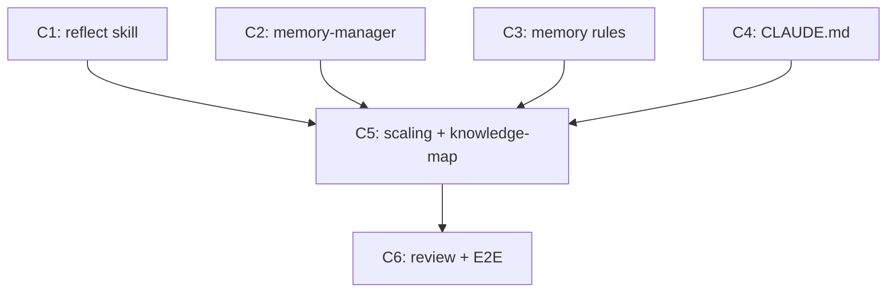

# Plan — Feedback Learning System

> Implementation strategy derived from the spec. Reviewable checkpoint before
> writing code.

## Approach

Create a new `/reflect` skill that fulfills the macro-level extraction
referenced throughout the memory system, then extend the existing memory-manager
and memory rules with rework tracking fields and adaptive calibration guidance.
All changes are additive — existing records and workflows remain valid. The
reflect skill is advisory (7 mandatory sections) and user-invocable.

## Components

### C1: Create `/reflect` skill

- **What**: New advisory skill at `.claude/skills/reflect/SKILL.md`. Implements
  FR-01 (audit workflow), FR-05 (reflection triggers), FR-06 (report format).
  User-invocable. Tools: `mcp__qdrant__qdrant-find`, `mcp__qdrant__qdrant-store`,
  `Read`, `Glob`, `AskUserQuestion`. All 7 mandatory sections. Description
  includes "Do NOT use for" cross-refs to memory-manager and deliberation.
- **Files**: `.claude/skills/reflect/SKILL.md` (create)
- **Dependencies**: none

### C2: Update memory-manager with reflect integration and rework fields

- **What**: Implements FR-02 (rework metadata: `task_type`, `correction_count`,
  `last_corrected`), FR-03 (error density query pattern), FR-07 (reflect
  integration guidance). Update error pattern template to include new fields.
  Add best practice for error density queries. Add when to suggest `/reflect`.
  Update "Do NOT use for" with symmetric cross-reference to reflect.
- **Files**: `.claude/skills/memory-manager/SKILL.md` (edit)
- **Dependencies**: none

### C3: Update memory rules with adaptive calibration

- **What**: Implements FR-04 (adaptive calibration rules) and FR-05 (reflection
  triggers as advisory guidance). Add a new "Adaptive Calibration" section:
  3+ high-confidence error patterns in a domain → bias toward deliberation/
  self-consistency; 0-1 → allow fast execution. Add reflection trigger
  conditions (post-spec, high density, explicit).
- **Files**: `.claude/rules/memory.md` (edit)
- **Dependencies**: none

### C4: Update CLAUDE.md with reflect skill mapping

- **What**: Add `reflect/audit → reflect` to Skill Loading keyword mapping.
  Add a bullet in Cognitive Memory for periodic reflection.
- **Files**: `.claude/CLAUDE.md` (edit)
- **Dependencies**: none

### C5: Integration updates (scaling, knowledge-map, cross-references)

- **What**: Update scaling.md: skill count 19→20, add `reflect` to Cognitive
  category. Update knowledge-map.md: add reflect skill, update memory types
  description, add Recent Decisions entry for spec 005.
- **Files**: `.claude/rules/scaling.md` (edit), `.claude/memory/knowledge-map.md` (edit)
- **Dependencies**: C1, C2, C3, C4

### C6: Review and E2E validation

- **What**: Review all modified files for consistency and adherence to authoring
  rules. Verify reflect skill has all 7 mandatory sections. Verify symmetric
  cross-references between reflect and memory-manager. Verify backward
  compatibility (existing records without new fields still valid). Verify
  CLAUDE.md stays under 200 lines.
- **Files**: all modified files (read-only)
- **Dependencies**: C5

## Execution Order

1. **C1 || C2 || C3 || C4** (parallel) — All modify different files with no
   dependencies. C1 creates a new file; C2-C4 edit existing ones.
2. **C5** — Integration updates after all core changes are done.
3. **C6** — Review and validation after everything is in place.

## Dependency Graph

## Sub-Specs

None — no component triggers 2+ complexity heuristics.

## Risks & Mitigations

| Risk | Impact | Mitigation |
|------|--------|------------|
| Reflect skill exceeds 500-line body budget with all 7 sections | Medium | Keep examples concise (3-4 lines each). Use tables for report format instead of verbose prose. Target ~250 lines. |
| Confusability between reflect and memory-manager | Medium | Clear "Do NOT use for" clauses in both. Reflect audits/consolidates; memory-manager stores/retrieves. Different triggers. |
| Qdrant query limit (10 per reflection) constrains audit depth | Low | Batch queries by type+domain (5 types × 2 queries max). Use broad queries with post-processing rather than narrow individual ones. |
| Adaptive calibration thresholds too aggressive or too conservative | Low | Make thresholds advisory with concrete numbers (3+ patterns = deliberate). User can override. |

## Testing Strategy

- **Manual verification**: Walk through each modified file and verify:
  - reflect SKILL.md has all 7 mandatory sections, description < 1024 chars, body < 500 lines
  - memory-manager has rework fields in error pattern template, error density query pattern, reflect integration
  - memory.md has adaptive calibration section with concrete thresholds
  - CLAUDE.md stays under 200 lines
  - scaling.md count = 20, reflect in Cognitive category
- **Cross-reference audit**: Verify symmetric "Do NOT use for" between reflect and memory-manager
- **Backward compatibility**: Confirm existing error-pattern records without `task_type`/`correction_count`/`last_corrected` are described as valid (fields optional for old records)
- **E2E walkthrough**: Trace through a hypothetical reflection session to verify the workflow makes sense

## Alternatives Considered

| Alternative | Why rejected |
|-------------|-------------|
| Merge reflect into memory-manager as a workflow mode | Different invocation pattern (periodic audit vs. per-action storage). Separate skill keeps responsibilities clear and follows the pattern established by deliberation/self-consistency. |
| Store reflection results as a new Qdrant record type | Reflection consolidates existing records — creating a new type adds complexity without value. The report is ephemeral. |
| Automatic reflection after every session | Spec requires NFR-02 (non-blocking) and explicitly excludes automatic reflection. Advisory triggers are sufficient. |
| Track correction_count in a separate file instead of Qdrant metadata | Fragments data across two systems. Qdrant metadata keeps everything queryable in one place. |
