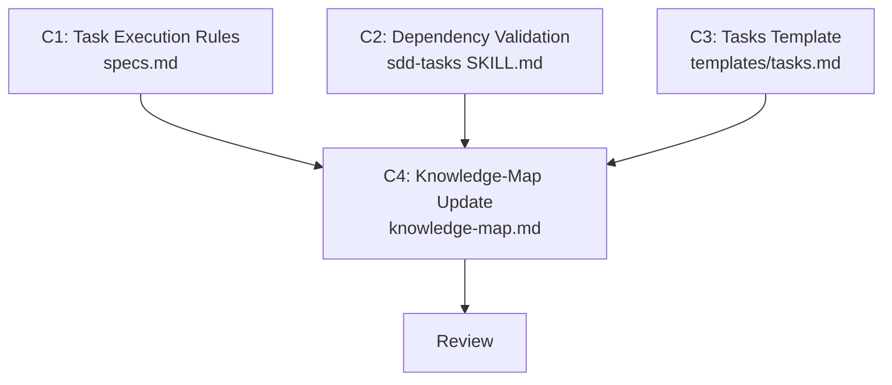

# Plan — Task Dependency Graph

> Implementation strategy derived from the spec. Reviewable checkpoint before
> writing code.

## Approach

Extend the existing SDD orchestration layer to **consume** the dependency
metadata that tasks.md already produces. The change is purely in rules and
skill instructions — no Python code. Three files are modified: `specs.md` gets
a new "Task Execution" section with the DAG-aware algorithm, `sdd-tasks`
SKILL.md gets a validation step in its workflow, and the tasks template gets
a standardized execution phases section.

## Components

### C1: Task Execution Rules

- **What**: Add a "Task Execution" section to `.claude/rules/specs.md` that
  replaces the current linear "Implementation Rule" with a dependency-aware
  algorithm. The algorithm: (1) parse tasks and `Depends on:` fields to build
  a DAG, (2) derive execution phases (topological sort), (3) dispatch ready
  tasks in parallel (max 4 agents per batch), (4) re-evaluate after each batch,
  (5) handle blocked/failed tasks with user decision points.
- **Files**: `.claude/rules/specs.md` (edit — expand "Implementation Rule")
- **Dependencies**: none

### C2: Dependency Validation in sdd-tasks

- **What**: Add a validation step to the sdd-tasks skill workflow (between
  "Generate tasks" and "Write tasks"). The validation checks: (a) cycle
  detection (transitive), (b) missing task ID references, (c) self-references,
  (d) isolated task info-level warning. Validation errors block writing; warnings
  are reported but don't block.
- **Files**: `.claude/skills/sdd-tasks/SKILL.md` (edit — add step 4b)
- **Dependencies**: none (validation rules are self-contained)

### C3: Tasks Template Enhancement

- **What**: Update the tasks template to include: (a) a standardized
  "Execution Phases" section showing derived phases, (b) task ID format
  guidance (T-XX), (c) `[-]` skipped marker documentation, (d) clarify that
  `Depends on: none` is explicit and omitting the field implies the same.
- **Files**: `.specify/templates/tasks.md` (edit)
- **Dependencies**: none

### C4: Knowledge-Map & Scaling Update

- **What**: Update knowledge-map.md to reflect: (a) specs.md now includes
  dependency-aware task execution rules, (b) sdd-tasks validates dependency
  graphs, (c) add spec 006 to Recent Decisions. Update scaling.md spec count
  if needed (skill count unchanged — no new skill added).
- **Files**: `.claude/memory/knowledge-map.md` (edit),
  `.claude/rules/scaling.md` (read-only — verify count unchanged)
- **Dependencies**: C1, C2, C3 (must reflect final state of all changes)

## Execution Order

1. **C1 || C2 || C3** (parallel) — all three are independent edits to
   different files with no dependencies between them.
2. **C4** (sequential) — must wait for C1–C3 to complete so it can accurately
   reflect the final state of all changes.
3. **Review** — reviewer verifies all changes for consistency.

## Dependency Graph

## Sub-Specs

None — all components scored below the complexity threshold (max 1/4
heuristics triggered per component).

## Risks & Mitigations

| Risk | Impact | Mitigation |
|------|--------|------------|
| Orchestration rules are too verbose and push specs.md over reasonable length | Medium | Keep the algorithm concise (numbered steps, not prose). Current specs.md is ~110 lines; budget max 50 additional lines for the new section. |
| sdd-tasks validation instructions are ambiguous and the agent can't reliably detect cycles from natural-language rules alone | Medium | Describe the cycle detection algorithm explicitly (walk each dependency chain; if you visit a task ID twice, it's a cycle). Include an example. |
| `[-]` skipped marker breaks existing tooling that only expects `[x]` and `[ ]` | Low | The marker is only written by the orchestrating agent — it's a convention, not parsed by external tools. Document it clearly. |

## Testing Strategy

- **Unit**: Reviewer agent verifies each file independently — specs.md rules
  are internally consistent, sdd-tasks validation steps are complete, template
  is well-formed.
- **Integration**: Tester agent walks through spec 004's tasks.md with the new
  execution rules and verifies: correct phase derivation, parallel groups
  identified, blocked tasks detected.
- **Manual verification**: User reviews the execution phase output format by
  inspecting the template and a worked example in the rules.

## Alternatives Considered

| Alternative | Why rejected |
|-------------|-------------|
| Python DAG parser script | Spec explicitly excludes code dependencies (NFR-02). Agent-interpreted rules are simpler and consistent with the project's "rules, not code" approach. |
| New dedicated orchestration skill | Overkill — the orchestration logic is part of spec execution, which already lives in specs.md. A separate skill would fragment the workflow. |
| Mermaid graphs in tasks.md | Tasks.md is consumed by agents, not rendered visually. ASCII dependency graphs are more parseable for LLMs than Mermaid syntax. |
