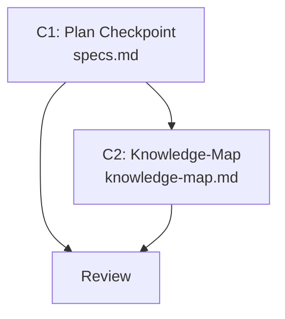

# Plan — Dynamic Replanning

> Implementation strategy derived from the spec. Reviewable checkpoint before
> writing code.

## Approach

Extend the existing Task Execution re-evaluation loop in `specs.md` with a
plan checkpoint step. The checkpoint sits between "mark tasks `[x]`" and
"derive next batch" — it evaluates three signals (failure, contradiction,
coherence) using information already available from the batch. If all pass,
execution continues silently. If any fail, a structured deviation report is
presented to the user. This is a surgical edit to one section of one file.

## Components

### C1: Plan Checkpoint in Task Execution

- **What**: Add a "Plan checkpoint" paragraph to the Task Execution subsection
  of `specs.md`. It defines: (1) the three signal checks with concrete
  indicators, (2) the silent-pass rule, (3) the deviation report format, and
  (4) the plan adjustment flow (suggest → approve → re-derive phases).
- **Files**: `.claude/rules/specs.md` (edit — extend the re-evaluation loop)
- **Dependencies**: none (builds on spec 006's Task Execution section)

### C2: Knowledge-Map Update

- **What**: Update knowledge-map.md to reflect that specs.md now includes
  plan checkpoints with deviation detection. Add spec 007 to Recent Decisions.
- **Files**: `.claude/memory/knowledge-map.md` (edit)
- **Dependencies**: C1

## Execution Order

1. **C1** — edit specs.md to add the checkpoint logic
2. **C2** — update knowledge-map after C1 is reviewed

## Dependency Graph

## Sub-Specs

None — both components scored 0/4 on the complexity heuristics.

## Risks & Mitigations

| Risk | Impact | Mitigation |
|------|--------|------------|
| specs.md exceeds 170-line constraint after adding checkpoint text | Medium | Budget max 20 lines for the checkpoint. Current file is ~145 lines. 145 + 20 = 165, within limit. |
| Checkpoint logic is too vague for the agent to follow reliably | Medium | Use concrete signal indicators (not abstract concepts). Each signal has explicit conditions that trigger it. |
| Checkpoint adds latency on the happy path | Low | FR-07 ensures silent pass — zero user-visible overhead when all signals pass. |

## Testing Strategy

- **Unit**: Reviewer verifies specs.md checkpoint logic is internally
  consistent with the existing re-evaluation loop and doesn't contradict
  spec 006's task execution rules.
- **Integration**: Tester walks through a hypothetical scenario where a
  contradiction signal fires mid-execution and verifies the deviation report
  format and plan adjustment flow are complete.
- **Manual verification**: User reads the updated Task Execution section and
  confirms the checkpoint fits naturally in the execution flow.

## Alternatives Considered

| Alternative | Why rejected |
|-------------|-------------|
| Heavyweight checkpoint (re-read plan.md after each batch) | NFR-01 prohibits heavyweight analysis. Re-reading plan.md adds latency and token cost on every batch. |
| Separate checkpoint rules file | NFR-02 prohibits new files. The checkpoint is part of task execution, not a standalone concern. |
| Auto-update plan.md for minor deviations | User explicitly chose suggest-only. Auto-updates risk silent plan drift — the very problem this spec solves. |
