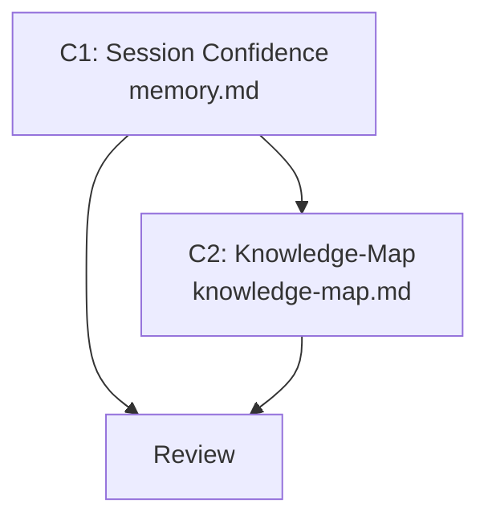

# Plan — Intra-Session Adaptation

> Implementation strategy derived from the spec. Reviewable checkpoint before
> writing code.

## Approach

Add a "Session Confidence" section to `memory.md` that defines the ephemeral
confidence tracker. The section integrates with the existing Adaptive
Calibration section — they are complementary layers (cross-session vs
intra-session). One file gets substantive changes, one gets a metadata update.

## Components

### C1: Session Confidence Section in memory.md

- **What**: Add a new section after "Adaptive Calibration" in memory.md.
  Defines: three confidence levels (NEUTRAL, CAUTIOUS, DELIBERATE),
  degradation triggers (user correction, reviewer rejection, backtracking),
  domain scoping, integration with Adaptive Calibration (cross-session
  high-error domains start at CAUTIOUS), and zero-overhead happy path.
- **Files**: `.claude/rules/memory.md` (edit)
- **Dependencies**: none

### C2: Knowledge-Map Update

- **What**: Update knowledge-map.md to reflect session confidence tracking
  in memory.md. Add spec 008 to Recent Decisions.
- **Files**: `.claude/memory/knowledge-map.md` (edit)
- **Dependencies**: C1

## Execution Order

1. **C1** — add session confidence section
2. **C2** — update knowledge-map after C1 is reviewed

## Dependency Graph

## Sub-Specs

None — both components scored 0/4 on complexity heuristics.

## Risks & Mitigations

| Risk | Impact | Mitigation |
|------|--------|------------|
| memory.md exceeds 120-line constraint | Medium | Current file is 93 lines. Budget max 25 lines for new section. 93 + 25 = 118, within limit. |
| Tracker rules are too vague for the agent to follow | Medium | Use concrete examples: "if user corrects a Python output, domain=python degrades by one level" |
| Overlap/confusion with Adaptive Calibration section | Low | Explicitly state the relationship: cross-session = Qdrant query, intra-session = ephemeral tracker. Both trigger independently. |

## Testing Strategy

- **Unit**: Reviewer verifies memory.md section is internally consistent
  and doesn't contradict existing Adaptive Calibration rules.
- **Integration**: Tester walks through a scenario where 2 corrections in
  Python domain trigger DELIBERATE level.
- **Manual verification**: User reads the section and confirms it matches
  expected behavior.

## Alternatives Considered

| Alternative | Why rejected |
|-------------|-------------|
| Persist session confidence to a temp file | NFR-01 requires ephemeral. File persistence adds complexity for a session-scoped concept. |
| Add confidence tracking to CLAUDE.md | CLAUDE.md has a 200-line limit and is already dense. memory.md is the natural home for calibration rules. |
| Add a dedicated session-tracker skill | NFR-02 prohibits new skills. The tracker is a mental model, not a workflow. |
