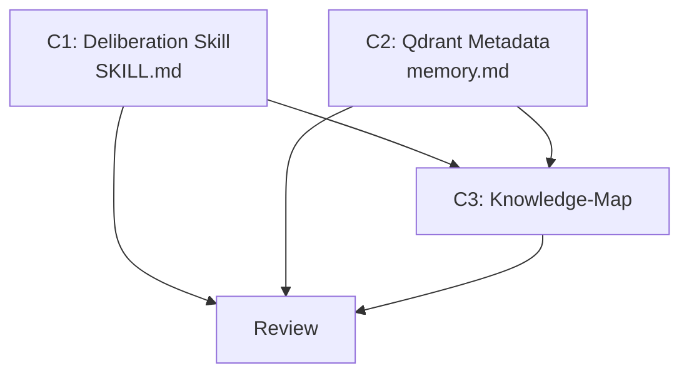

# Plan — Multidimensional Confidence

> Implementation strategy derived from the spec. Reviewable checkpoint before
> writing code.

## Approach

Update the deliberation skill's DECIDE step, decision record template,
confidence calibration section, and examples to include per-dimension
confidence scores. The 7-step process structure is unchanged — dimensions
are an output enhancement to step 6 (DECIDE), not new steps. Also update
the Qdrant metadata documentation in memory.md to note the optional
`confidence_dimensions` field.

## Components

### C1: Deliberation Skill Updates

- **What**: Edit the deliberation SKILL.md to:
  (a) Add dimension definitions to Core Principles (feasibility, cost, risk
  with weights 0.40/0.30/0.30).
  (b) Update DECIDE step (step 6) format to include per-dimension scores.
  (c) Update decision record template with dimensional scores.
  (d) Add targeted follow-up guidance (feasibility LOW → spike, cost LOW →
  research, risk LOW → revisit mitigations).
  (e) Update confidence calibration section with dimension-based thresholds.
  (f) Update examples to show dimensional confidence.
- **Files**: `.claude/skills/deliberation/SKILL.md` (edit)
- **Dependencies**: none

### C2: Qdrant Metadata Extension

- **What**: Add a note to memory.md General Rules section documenting the
  optional `confidence_dimensions` metadata field for deliberation records.
- **Files**: `.claude/rules/memory.md` (edit — 1-2 lines)
- **Dependencies**: none

### C3: Knowledge-Map Update

- **What**: Update knowledge-map for spec 009. Update deliberation entry
  in Skills section. Add to Recent Decisions.
- **Files**: `.claude/memory/knowledge-map.md` (edit)
- **Dependencies**: C1, C2

## Execution Order

1. **C1 || C2** (parallel) — independent file edits
2. **C3** (sequential) — after review of C1 + C2

## Dependency Graph

## Sub-Specs

None — C1 is the largest component (1 file, 1 architectural decision on
dimension weights) but scores 1/4 on complexity heuristics.

## Risks & Mitigations

| Risk | Impact | Mitigation |
|------|--------|------------|
| Deliberation SKILL.md exceeds 500-line limit after changes | Medium | Current file is ~320 lines. Budget max 30 lines for dimension additions (replace existing single-score text, don't just append). Net growth should be ~15-20 lines. |
| Examples become verbose with dimensional scores | Low | Keep examples concise — add 2-3 lines per example for dimensions, not full rewrites. |
| Weighted aggregate formula is confusing | Low | State weights once in Core Principles, reference in DECIDE step. Don't repeat formula in every example. |

## Testing Strategy

- **Unit**: Reviewer verifies DECIDE step format, decision record template,
  and calibration section are internally consistent.
- **Integration**: Tester walks through example scenario 1 (caching decision)
  with dimensional scores and verifies the follow-up guidance triggers
  correctly.
- **Manual verification**: User reads updated skill and confirms dimensional
  scoring is clear and the existing 7-step process is unchanged.

## Alternatives Considered

| Alternative | Why rejected |
|-------------|-------------|
| Update both deliberation and self-consistency | Higher blast radius. Self-consistency's rubric scores already provide dimensional data. Only deliberation needs the explicit dimension model. |
| Domain-specific dimension weights | Over-engineering. Fixed weights (0.40/0.30/0.30) are sufficient. Domain rubric overrides are already in self-consistency. |
| 5 dimensions (add security, performance) | More dimensions dilute focus. 3 dimensions map cleanly to deliberation's existing steps (GENERATE→feasibility, COST CHECK→cost, PREMORTEM→risk). |
