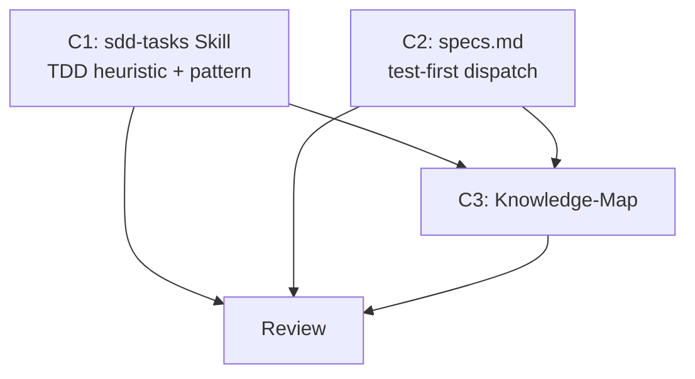

# Plan — TDD Guidance in Pipeline

> Implementation strategy derived from the spec. Reviewable checkpoint before
> writing code.

## Approach

Add advisory TDD guidance to two existing files: the `sdd-tasks` skill (where
tasks are generated) and `specs.md` (where tasks are executed). The guidance
uses a simple heuristic to identify test-first candidates and a `[TEST-FIRST]`
annotation that signals the 3-task pattern (write test → implement → verify).
The annotation works through the existing dependency mechanism — no new
execution logic needed.

## Components

### C1: sdd-tasks Skill — TDD Heuristic and Task Pattern

- **What**: Update `sdd-tasks/SKILL.md` to:
  (a) Add a step 4c "TDD assessment" after the dependency graph validation
  (step 4b). For each implementer task, check if it matches the TDD heuristic:
  complex logic, behavioral contracts, bug fixes, or data transformations.
  (b) For matching tasks, generate the 3-task `[TEST-FIRST]` pattern: write
  test (tester) → implement (implementer) → verify (tester), linked by
  dependencies.
  (c) Add a constraint noting that `[TEST-FIRST]` is advisory — show
  recommendations during the confirmation step so the user can accept or
  remove them.
  (d) Bump version to 1.2.0.
- **Files**: `.claude/skills/sdd-tasks/SKILL.md` (edit)
- **Dependencies**: none

### C2: specs.md — Test-First Dispatch Note

- **What**: Add a brief note to the Task Execution section in `specs.md`
  explaining that `[TEST-FIRST]` annotated tasks use a tester → implementer →
  tester sequence, handled naturally by task dependencies. Add 3-4 lines
  after the "Parallel dispatch" paragraph. Keep within 170-line budget.
- **Files**: `.claude/rules/specs.md` (edit — 3-4 lines)
- **Dependencies**: none

### C3: Knowledge-Map Update

- **What**: Update knowledge-map.md: (a) update sdd-tasks entry to mention
  TDD heuristic; (b) update specs list to include 010; (c) add spec 010 to
  Recent Decisions.
- **Files**: `.claude/memory/knowledge-map.md` (edit)
- **Dependencies**: C1, C2

## Execution Order

1. **C1 || C2** (parallel) — independent file edits
2. **C3** (sequential) — after review of C1 + C2

## Dependency Graph

## Sub-Specs

None — all components score 0/4 on complexity heuristics.

## Risks & Mitigations

| Risk | Impact | Mitigation |
|------|--------|------------|
| specs.md exceeds 170-line budget after adding test-first note | Medium | Budget is tight (159 lines). Keep addition to 3-4 lines. Can compress existing whitespace if needed. |
| TDD heuristic is too broad, flagging too many tasks | Low | Heuristic targets specific task types (complex logic, APIs, bug fixes). Config/docs/rules tasks are explicitly excluded. User can remove annotations at confirmation. |
| `[TEST-FIRST]` pattern inflates task count | Low | The 3-task pattern replaces a 2-task pattern (implement + review/test). Net increase is 1 task per TDD candidate. Advisory nature means the user controls how many tasks use it. |

## Testing Strategy

- **Unit**: Reviewer verifies sdd-tasks SKILL.md has all required sections,
  stays under 500 lines, and the heuristic criteria are clearly defined.
- **Integration**: Tester walks through a scenario where sdd-tasks generates
  a task list containing both TDD and non-TDD tasks, verifying correct
  annotation and dependency structure.
- **Manual verification**: User reads updated skill and confirms TDD guidance
  is clear and non-blocking.

## Alternatives Considered

| Alternative | Why rejected |
|-------------|-------------|
| Enforce TDD for all tasks with test coverage | Over-engineering. Many SDD tasks are rules/docs changes with no testable code. Enforcement would add friction without value. |
| Add TDD guidance to the tester agent instead | Wrong location. The ordering decision happens at task generation (sdd-tasks) and execution (specs.md), not within the tester agent itself. |
| Create a separate TDD skill | Unnecessary. The guidance is small (~15-20 lines in sdd-tasks, ~4 lines in specs.md) and fits naturally in existing files. A separate skill would add routing overhead. |
