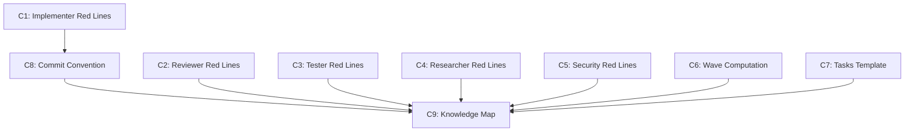

# Plan — Agent Hardening

> Implementation strategy derived from the spec. Reviewable checkpoint before
> writing code.

## Approach

Add deterministic guard rails to all 5 agents via two additive sections (Red
Lines table + 3-failure stop rule), update the SDD pipeline with pre-computed
wave annotations and a per-task commit convention. All changes are text edits
to existing Markdown files — no new files, no code, no structural changes.
Components are largely independent and can execute in parallel.

## Components

### C1: Red Lines + Stop Rule — Implementer Agent

- **What**: Add `## Red Lines` section with anti-rationalization table (5-7
  entries targeting implementer-specific failure modes) and uniform 3-attempt
  stop rule. Replace existing "5 fix-rerun cycles" with 3.
- **Files**: `.claude/agents/implementer/AGENT.md`
- **Dependencies**: none

### C2: Red Lines + Stop Rule — Reviewer Agent

- **What**: Add `## Red Lines` section targeting reviewer-specific failure
  modes (soft-passing, not reading full files, missing security concerns).
  Add 3-attempt stop rule.
- **Files**: `.claude/agents/reviewer/AGENT.md`
- **Dependencies**: none

### C3: Red Lines + Stop Rule — Tester Agent

- **What**: Add `## Red Lines` section targeting tester-specific failure modes
  (claiming tests pass without running them, ignoring flaky tests, not reading
  source before writing tests). Existing 3-cycle limit already aligns — add
  explicit stop-and-report language.
- **Files**: `.claude/agents/tester/AGENT.md`
- **Dependencies**: none

### C4: Red Lines + Stop Rule — Researcher Agent

- **What**: Add `## Red Lines` section targeting researcher-specific failure
  modes (single-source conclusions, guessing without searching, not checking
  Qdrant KB first). Add 3-attempt stop rule for failed searches.
- **Files**: `.claude/agents/researcher/AGENT.md`
- **Dependencies**: none

### C5: Red Lines + Stop Rule — Security Agent

- **What**: Add `## Red Lines` section targeting security-specific failure
  modes (clean audit without running scanners, downgrading severity, not
  checking CVE databases). Add 3-attempt stop rule.
- **Files**: `.claude/agents/security/AGENT.md`
- **Dependencies**: none

### C6: Wave Computation in sdd-tasks

- **What**: Add wave assignment logic after dependency graph validation
  (step 4b). Compute `Wave: N` for each task using topological sort of the
  dependency DAG. Annotate each task with the wave field. Update the Execution
  Phases table to use wave numbers.
- **Files**: `.claude/skills/sdd-tasks/SKILL.md`
- **Dependencies**: none

### C7: Tasks Template Update

- **What**: Add `Wave:` field to the task entry format in the template.
  Update the Execution Phases table to reference waves instead of generic
  phases.
- **Files**: `.specify/templates/tasks.md`
- **Dependencies**: none

### C8: Per-Task Commit Convention

- **What**: Add commit convention instruction to implementer AGENT.md
  (in the "How You Work" step 6-7 area) and document the convention in
  specs.md Task Execution section.
- **Files**: `.claude/agents/implementer/AGENT.md`, `.claude/rules/specs.md`
- **Dependencies**: C1 (implementer agent is being modified — serialize to
  avoid conflict)

### C9: Knowledge Map Update

- **What**: Update `.claude/memory/knowledge-map.md` to reflect: agents now
  include Red Lines sections, sdd-tasks computes wave annotations, per-task
  commit convention added.
- **Files**: `.claude/memory/knowledge-map.md`
- **Dependencies**: C1, C2, C3, C4, C5, C6, C7, C8 (runs last as summary)

## Execution Order

1. **Wave 1** — C1, C2, C3, C4, C5, C6, C7 in parallel (all independent, no
   shared files). This is the bulk of the work.
2. **Wave 2** — C8 (modifies implementer AGENT.md after C1 finishes, plus
   specs.md).
3. **Wave 3** — C9 (knowledge-map update after everything else completes).

## Dependency Graph

## Sub-Specs

None — no component triggers 2+ complexity heuristics. All are single-file
text edits following the same pattern.

## Risks & Mitigations

| Risk | Impact | Mitigation |
|------|--------|------------|
| Agent body exceeds 100-line budget (agents.md rule) after adding Red Lines | Medium | Keep Red Lines to 5-7 entries max (~15 lines total with stop rule). Current agents are 70-90 lines; adding 15-20 lines may push some to ~105. Accept minor overage as justified — guard rails are high-value content. |
| Red Lines content is generic rather than agent-specific | Medium | Each agent's table MUST be drafted from observed failure modes in the 6-repo research, not copy-pasted. Review step verifies specificity. |
| Wave computation adds complexity to sdd-tasks without being used | Low | Wave is computed from the existing dependency graph (step 4b already validates it). The computation is a simple topological sort annotation — no new data structures. |
| Per-task commit convention ignored by implementer in practice | Low | Convention is advisory (NFR-03). The orchestrator can reinforce it in delegation prompts. Over time, hooks could enforce it. |

## Testing Strategy

- **Unit**: No code to unit test — all changes are Markdown instruction files.
- **Manual verification**:
  - Read each modified AGENT.md and verify Red Lines are agent-specific, not generic
  - Verify stop rule language is uniform across all 5 agents
  - Verify sdd-tasks SKILL.md wave logic is consistent with existing step 4b
  - Verify tasks.md template includes Wave field
  - Verify specs.md commit convention section is clear
  - Run `bash -n .claude/hooks/*.sh` (hooks unchanged but sanity check)

## Alternatives Considered

| Alternative | Why rejected |
|-------------|-------------|
| Single shared Red Lines file referenced by all agents | Loses agent-specificity — the key insight from superpowers/ring is that failure modes are role-specific. A shared file would trend toward generic platitudes. |
| Enforce wave via a hook instead of annotation in sdd-tasks | Over-engineering — a hook would need to parse tasks.md and validate waves at runtime. Annotation at generation time is simpler and equally effective. |
| Add Red Lines as a separate `RED_LINES.md` file per agent | Adds file count without benefit. Agents already have a single AGENT.md; adding a section is cleaner than adding a file. |
| 5-failure stop rule instead of 3 | Research convergence across superpowers and ring shows 3 is the sweet spot. 5 allows too much context burn before escalation. |
