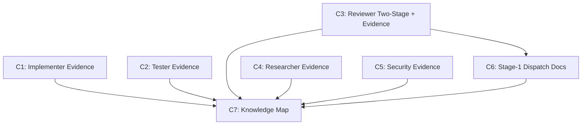

# Plan — Verification Gate + Two-Stage Review

> Implementation strategy derived from the spec. Reviewable checkpoint before
> writing code.

## Approach

Replace existing placeholder output sections (Quality Checks, Static Analysis)
with evidence-backed `## Evidence` sections across all 5 agents. Restructure
the reviewer's workflow into two explicit stages. All changes are text edits
to existing Markdown files — no new files, no code, no structural changes.
The reviewer component (C3) is the heaviest since it combines evidence + two-stage
restructure, but it is still a single-file edit.

## Components

### C1: Evidence Section — Implementer Agent

- **What**: Replace `## Quality Checks` in output format with `## Evidence`
  containing mandatory fields for actual ruff, mypy, and pytest terminal output
  (truncated to last 30 lines if long). Add Markdown-only exemption note. Add
  Red Line entry: "Emitting SIGNAL:DONE with empty evidence fields."
- **Files**: `.claude/agents/implementer/AGENT.md`
- **Dependencies**: none

### C2: Evidence Section — Tester Agent

- **What**: Add `## Evidence` section to output format with mandatory
  `pytest_output` and conditional `coverage_output` fields. Add Markdown-only
  exemption. Add Red Line entry for empty evidence.
- **Files**: `.claude/agents/tester/AGENT.md`
- **Dependencies**: none

### C3: Two-Stage Review + Evidence — Reviewer Agent

- **What**: Restructure "How You Work" steps 3-5 into Stage 1 (Automated:
  ruff, mypy, CodeRabbit) and Stage 2 (Deep: logic, security, conventions,
  design). Replace `## Static Analysis` in output format with `## Evidence`
  (containing ruff/mypy/coderabbit output). Split `## Issues` into
  `## Stage 1: Automated Findings` and `## Stage 2: Deep Findings`. Add
  Markdown-only exemption. Add Red Line entry for empty evidence. Add
  instruction that `stage: 1` in task prompt means skip Stage 2.
- **Files**: `.claude/agents/reviewer/AGENT.md`
- **Dependencies**: none

### C4: Evidence Section — Researcher Agent

- **What**: Add `## Evidence` section to output format listing tool calls made
  (search queries executed, URLs fetched, KB queries). Add Red Line entry for
  empty evidence. Researcher evidence is a tool call log, not terminal output.
- **Files**: `.claude/agents/researcher/AGENT.md`
- **Dependencies**: none

### C5: Evidence Section — Security Agent

- **What**: Add `## Evidence` section to output format listing scanners run
  and their output (bandit, pip-audit, safety, semgrep results). Add Red Line
  entry for empty evidence. Note which scanners were unavailable.
- **Files**: `.claude/agents/security/AGENT.md`
- **Dependencies**: none

### C6: Stage-1-Only Dispatch Documentation

- **What**: Add documentation to specs.md Task Execution section: for
  Markdown-only or config-only changes, the orchestrator may dispatch the
  reviewer with `stage: 1` to skip the deep review phase. Define what
  qualifies as "low-risk" (all modified files are .md, .yml, .yaml, .json,
  .toml, or .cfg).
- **Files**: `.claude/rules/specs.md`
- **Dependencies**: C3 (reviewer must have Stage 1/2 structure first)

### C7: Knowledge Map Update

- **What**: Update knowledge-map.md to reflect: agents now include Evidence
  sections, reviewer operates in two stages, stage-1-only dispatch available.
- **Files**: `.claude/memory/knowledge-map.md`
- **Dependencies**: C1, C2, C3, C4, C5, C6 (runs last as summary)

## Execution Order

1. **Wave 1** — C1, C2, C3, C4, C5 in parallel (all independent, all
   different files). C3 is the heaviest but still a single-file edit.
2. **Wave 2** — C6 (modifies specs.md after C3 establishes the two-stage
   structure in the reviewer).
3. **Wave 3** — C7 (knowledge-map update after everything else completes).

## Dependency Graph

## Sub-Specs

None — no component triggers 2+ complexity heuristics. All are single-file
text edits following the pattern established in spec 011.

## Risks & Mitigations

| Risk | Impact | Mitigation |
|------|--------|------------|
| Evidence sections make agent output too long, burning context | Medium | NFR-01: truncate to last 30 lines. Terminal has full output. Evidence is proof, not a log dump. |
| Reviewer body exceeds 100-line budget after two-stage restructure | Medium | The restructure replaces existing steps 3-5 (not adds). Net line change should be ~10-15 lines. Current body is ~98 lines; may reach ~110. Same justification as spec 011 — guard rails are high-value. |
| Agents treat "N/A — Markdown-only changes" as a loophole to skip evidence on code tasks | Low | The exemption is scoped explicitly: "when ALL modified files are .md." Mix of .md and .py = evidence required. Red Lines table reinforces this. |
| Stage-1-only dispatch reduces review quality for borderline changes | Low | FR-08 scopes it to Markdown/config only. The orchestrator decides, not the reviewer. Any .py file triggers full two-stage. |

## Testing Strategy

- **Unit**: No code to unit test — all changes are Markdown instruction files.
- **Manual verification**:
  - Read each modified AGENT.md and verify Evidence section has correct mandatory fields
  - Verify Red Lines entry is present in all 5 agents
  - Verify reviewer workflow is clearly split into Stage 1 and Stage 2
  - Verify reviewer output format separates automated vs deep findings
  - Verify specs.md documents stage-1-only dispatch with clear scope
  - Verify existing agent functionality is preserved (no removed sections besides
    Quality Checks → Evidence and Static Analysis → Evidence replacements)

## Alternatives Considered

| Alternative | Why rejected |
|-------------|-------------|
| Evidence as a separate file (`.artifacts/{agent}-evidence.md`) | Adds file management overhead. Evidence inline in the report keeps everything in one place and is easier for the orchestrator to verify. |
| Hook-based enforcement (parse agent output, reject if evidence is empty) | Valuable but over-engineering for now. Would require Markdown parsing in a shell script. Better as a future spec once the pattern proves itself in practice. |
| Three-stage review (automated → logic → security) | Over-segmentation. Security is part of the deep review skillset. Two stages (mechanical vs. judgment) is the right split. |
| Evidence section only for implementer and tester (skip researcher/security) | Researcher and security have the same "guessing without searching" risk. A tool call log is lightweight evidence that closes this gap. |
