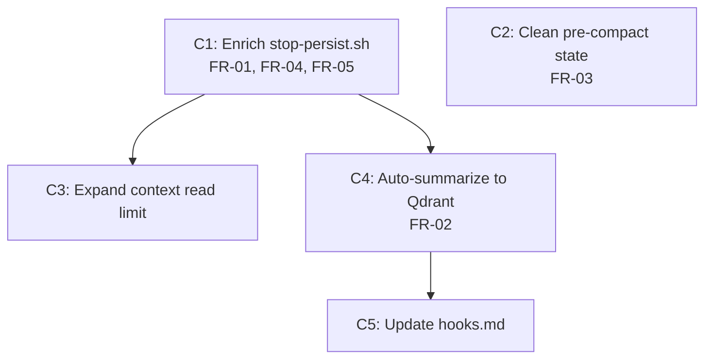

# Plan — Session Memory Improvements

> Implementation strategy derived from the spec. Reviewable checkpoint before
> writing code.

## Approach

Enrich the existing hook-based session memory system with five incremental
improvements. All changes follow existing patterns in `_lib.sh` and
`hooks.md`. The main work is in `stop-persist.sh` (3 of 5 FRs), with one
new hook for Qdrant auto-summarize and a one-line fix in reinject. No new
dependencies, no format changes — just richer data flowing through the same
pipes.

## Components

### C1 — Enrich stop-persist.sh (FR-01, FR-04, FR-05)

- **What**: Add three new sections to the session log: work summary (active
  spec + pending tasks + recently edited files), session duration (computed
  from metrics.jsonl `session_start` timestamp), and session outcome
  (classified from hook input or heuristic)
- **Files**: `.claude/hooks/stop-persist.sh`
- **Dependencies**: None — modifies existing hook in-place

**FR-01 — Work summary** appends to the log:
- Active spec: scan `.specify/specs/*/tasks.md` for files modified in the last
  60 minutes (same approach as `pre-compact-save.sh`, line 34-36). Extract
  the spec ID from the path.
- Pending tasks: count `[ ]` vs `[x]` lines in the active `tasks.md` to show
  progress (e.g., `progress: 3/7 tasks done`)
- Recently edited files: extract from the last 50 lines of `metrics.jsonl`
  (same approach as `pre-compact-save.sh`, lines 27-29)

**FR-04 — Duration**: read the last `session_start` event from `metrics.jsonl`
to get start timestamp. Compute difference from current time in minutes. If
metrics.jsonl is missing or has no `session_start`, omit gracefully (fail-open).

**FR-05 — Outcome**: The Stop hook input includes `stop_reason` (from Claude
Code's hook contract). Classification heuristic:
- If `stop_reason` contains "end_turn" or is empty → `completed`
- If `stop_reason` contains "interrupt" or "cancel" → `interrupted`
- Else → `completed` (fail-open default — don't classify unknowns as errors)

New log format (additive, existing fields unchanged):
```
session: abc123
time: 2026-03-12T14:30:00Z
branch: main
mode: auto
duration: 42m
outcome: completed

commits:
abc1234 feat: add auth module
def5678 fix: token refresh

uncommitted:
M src/auth.py
A src/tokens.py

working-on: 011-agent-hardening (5/7 tasks done)

recent-files: .claude/hooks/stop-persist.sh, .claude/rules/hooks.md
```

### C2 — Clean pre-compact state after reinject (FR-03)

- **What**: Delete `.pre-compact-state.json` after `session-start-reinject.sh`
  successfully reads and injects it. This prevents stale state from being
  re-injected in a future compaction cycle or a different session.
- **Files**: `.claude/hooks/session-start-reinject.sh`
- **Dependencies**: None

Add `rm -f "$STATE_FILE"` after the state extraction block (after line 48,
before the context output). The `rm -f` is idempotent and fail-safe.

### C3 — Expand session-start-context.sh read limit

- **What**: Increase the `head -20` limit on session log reading to `head -40`
  to accommodate the richer log content from C1. The new fields (work summary,
  duration, outcome, recent-files) add ~8-10 lines.
- **Files**: `.claude/hooks/session-start-context.sh`
- **Dependencies**: C1 (the richer log must exist for this to matter, but the
  change is backward-compatible — old short logs just have fewer lines)

### C4 — Auto-summarize to Qdrant (FR-02)

- **What**: New hook `session-start-summarize.sh` that runs on SessionStart
  (startup). Counts session logs in the directory. When count reaches a
  threshold (5, configurable via `MARVIN_SUMMARIZE_INTERVAL`), reads all logs,
  produces a 2-3 sentence text summary, and outputs a JSON instruction for
  Marvin to store to Qdrant via `additionalContext`. After outputting the
  instruction, writes a `.last-summarized` marker file with the current
  timestamp to prevent re-triggering.
- **Files**: `.claude/hooks/session-start-summarize.sh` (new),
  `.claude/settings.json` (register hook)
- **Dependencies**: C1 (richer logs produce better summaries, but works with
  old-format logs too)

Design decisions for open questions:
- **Cadence**: session-count-based (default 5), not time-based. Simpler to
  implement, and sessions are the natural unit of work.
- **Trigger**: separate hook (`session-start-summarize.sh`) per role separation
  rule. Role: `persist` (it instructs Marvin to store data).
- **Mechanism**: the hook cannot call Qdrant directly (no MCP access from
  bash). Instead, it outputs `additionalContext` with an instruction like
  "Store this session summary to Qdrant via qdrant-store..." and Marvin
  handles the actual storage. This follows the advisory pattern — if Marvin
  doesn't act on it, nothing breaks.

The hook checks:
1. Count `.log` files in `session_logs/`
2. If count < threshold OR `.last-summarized` was modified within the last
   N sessions, skip
3. Otherwise, concatenate all logs, extract key patterns (specs worked on,
   branches, outcomes), compose a summary, output as `additionalContext`
4. Write `.last-summarized` marker

### C5 — Update hooks.md inventory

- **What**: Add `session-start-summarize.sh` to the hook inventory table and
  update the Session Logs section to document the new log fields.
- **Files**: `.claude/rules/hooks.md`
- **Dependencies**: C4 (new hook must exist first)

## Execution Order

1. **C1** — Enrich `stop-persist.sh` (foundation — all other components
   benefit from richer logs)
2. **C2** — Clean pre-compact state (independent, trivial)
3. **C3** — Expand read limit in `session-start-context.sh` (depends on C1
   for the richer log to exist)
4. **C4** — Create `session-start-summarize.sh` + register in settings.json
   (depends on C1 for richer content, but functionally independent)
5. **C5** — Update hooks.md documentation (depends on C4 for the new hook name)

C1 and C2 can run in parallel (independent files). C3 and C4 can run in
parallel after C1 completes. C5 runs last.

## Dependency Graph



## Sub-Specs

None — all components are straightforward modifications to existing hooks
following established patterns. No component triggers 2+ complexity heuristics.

## Risks & Mitigations

| Risk | Impact | Mitigation |
|------|--------|------------|
| `stop-persist.sh` takes >2s with spec scanning + metrics parsing | Medium | Use `find -mmin -60` (bounded), `tail -50` (bounded), and short-circuit if `.specify/` doesn't exist |
| Qdrant auto-summarize instruction ignored by Marvin (advisory pattern) | Low | The instruction is a best-effort nudge. Session logs are still retained locally. The feature degrades gracefully to the current behavior |
| Session log format change breaks `session-start-context.sh` parsing | Medium | New fields are additive and `head -40` is the only parsing — raw text is just read and injected as-is, no field extraction |
| `.last-summarized` marker leaks across projects (via install.sh copy) | Low | Place marker in `.claude/dev/` (gitignored), not in `.claude/` |

## Testing Strategy

- **Manual verification**:
  1. Start a session, do some work, stop → verify new log fields appear in
     `.claude/dev/session_logs/`
  2. Start a new session → verify `session-start-context.sh` injects the
     richer log
  3. Trigger compaction → verify `.pre-compact-state.json` is deleted after
     reinject
  4. Create 5+ session logs → verify summarize hook outputs context on next
     session start
- **Syntax check**: `bash -n .claude/hooks/*.sh` for all modified hooks
- **Regression**: Existing hooks must still pass syntax check. `session-start-context.sh`
  must work with both old-format (short) and new-format (enriched) logs

## Alternatives Considered

| Alternative | Why rejected |
|-------------|-------------|
| Structured session logs (JSON) | Violates `hooks.md` convention ("MUST NOT use structured formats for session logs"). Raw text is simpler to debug and grep |
| Qdrant auto-summarize on session end (Stop hook) | Stop is latency-sensitive (NFR-02). Session start is better — reading logs is fast, and the instruction is advisory |
| Single `session-start-context.sh` for both context and summarize | Violates hook role separation rule ("MUST NOT mix roles in a single hook") |
| Time-based summarize cadence (daily) | Session-count is simpler and aligns with the natural unit of work. Time-based would require cron or more complex timestamp math |
| Direct Qdrant call from bash hook | Hooks have no MCP access. Would require `curl` to Qdrant API directly, leaking credentials and adding a hard dependency. The advisory `additionalContext` pattern is cleaner |
