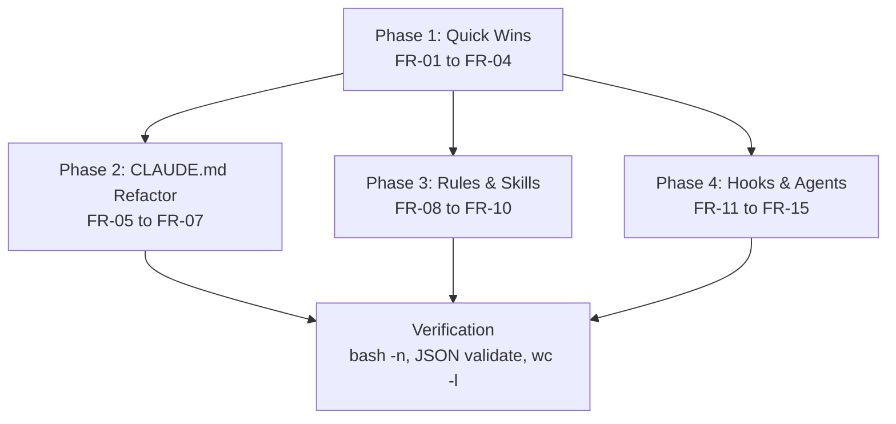

# Plan — Standard v2.0 Compliance

> Implementation strategy derived from the spec. Reviewable checkpoint before
> writing code.

## Approach

All 15 FRs are mechanical edits to existing Markdown, JSON, and shell files —
no new files, no Python, no architectural decisions. Group into 4 phases by
dependency: Phase 1 (quick wins, no dependencies) runs first; Phases 2-4 are
independent of each other and can run in parallel after Phase 1. Each phase
targets a distinct file set to avoid edit conflicts.

## Components

### Phase 1 — Quick Wins (FR-01 through FR-04)

- **What**: Targeted one-line fixes across agents, hooks, settings, and skills.
  These are the highest-priority findings that carry nonzero blast radius
  (Edit in read-only agents) or violate hook contracts (exit code bug).
- **Files**:
  - `.claude/agents/reviewer/AGENT.md` — remove `Edit` from `tools:`
  - `.claude/agents/researcher/AGENT.md` — remove `Edit` from `tools:`
  - `.claude/agents/security/AGENT.md` — remove `Edit` from `tools:`
  - `.claude/hooks/post-tool-use-mcp-monitor.sh` — `exit 2` → `exit 0`
  - `.claude/settings.json` — add `"async": true` to 2 PostToolUse entries
  - `.claude/skills/self-consistency/SKILL.md` — `category: orchestration`
  - `.claude/skills/memory-manager/SKILL.md` — `category: knowledge`
  - `.claude/skills/reflect/SKILL.md` — `category: workflow`
- **Dependencies**: None — can run immediately.

### Phase 2 — CLAUDE.md Refactor (FR-05 through FR-07)

- **What**: Trim CLAUDE.md from 122 → ≤100 lines. Remove duplicated content
  that exists in `@`-imported rule files, add HTML maintenance comment, add
  U-shaped bottom reinforcement section.
- **Files**:
  - `.claude/CLAUDE.md` — full restructure
- **Dependencies**: None (independent of other phases). Runs after Phase 1
  only for sequencing clarity — no actual dependency.
- **Detail**:
  - Remove Handoff Protocol body (lines 63-81, ~15 lines) — keep one-line
    pointer to `@.claude/rules/delegation.md`
  - Remove Cognitive Memory bullet list (lines 97-103, ~10 lines) — keep
    one-line pointer to `@.claude/rules/memory.md`
  - Collapse Skill Loading table (lines 33-38, ~8 lines) — single line
    referencing `@.claude/rules/delegation.md`
  - Remove Verify shell commands (lines 118-122, ~3 lines) — replace with
    pointer to `@docs/development-standard.md §9`
  - Add `<!-- budget: <100 lines; last pruned: 2026-03-12 -->` after heading
  - Add `## Critical Reminders` at bottom (3-5 lines) echoing top MUST rules

### Phase 3 — Rules & Skills Alignment (FR-08 through FR-10)

- **What**: Update rules files and SDD skill frontmatter to match v2.0
  requirements.
- **Files**:
  - `.claude/rules/specs.md` — add `claude-progress.txt` instruction in
    "Re-evaluation loop" section
  - `.claude/rules/skills.md` — update `metadata.category` line to list all
    4 valid values with safety semantics
  - `.claude/skills/sdd-constitution/SKILL.md` — add `tools:` field
  - `.claude/skills/sdd-specify/SKILL.md` — add `tools:` field
  - `.claude/skills/sdd-plan/SKILL.md` — add `tools:` field
  - `.claude/skills/sdd-tasks/SKILL.md` — add `tools:` field
- **Dependencies**: None (independent of other phases).
- **Detail for FR-10**: Read each SDD skill body to determine which tools it
  actually uses (Read, Write, Glob, Grep, Agent, AskUserQuestion, etc.)
  before adding the `tools:` frontmatter field.

### Phase 4 — Hook Refinements & Agent Polish (FR-11 through FR-15)

- **What**: Model diversity change, hook bug fixes, failure pattern
  consolidation, agent description trims, and deviation documentation.
- **Files**:
  - `.claude/agents/tester/AGENT.md` — `model: haiku` + comment
  - `.claude/hooks/post-tool-use-mcp-monitor.sh` — server name extraction fix
  - `.claude/hooks/_lib.sh` — add shared `AGENT_FAILURE_PATTERNS`
  - `.claude/hooks/subagent-stop-gate.sh` — source patterns from `_lib.sh`
  - `.claude/hooks/subagent-stop-log.sh` — source patterns from `_lib.sh`
  - `.claude/agents/implementer/AGENT.md` — trim description, add maxTurns comment
  - `.claude/agents/reviewer/AGENT.md` — trim description
  - `.claude/agents/researcher/AGENT.md` — trim description, add memory comment
  - `.claude/agents/security/AGENT.md` — trim description
  - `.claude/agents/tester/AGENT.md` — trim description
- **Dependencies**: Phase 1 must complete first (FR-01 modifies the same
  agent files that FR-14 will trim descriptions on).
- **Detail for FR-13**: The gate has 4 patterns (`I could not`, `I cannot`,
  `I'm unable`, `no results found`) while the log has 6 (adds `failed to`,
  `error occurred`). The superset of 6 patterns becomes the shared variable
  in `_lib.sh`. Both scripts source it. The gate's grep uses the shared
  variable; the log's grep uses the same.

## Execution Order

1. **Phase 1** — Quick wins (FR-01 to FR-04). No dependencies. Execute first.
2. **Phase 2** — CLAUDE.md refactor (FR-05 to FR-07). Independent.
3. **Phase 3** — Rules & skills alignment (FR-08 to FR-10). Independent.
4. **Phase 4** — Hook refinements & agent polish (FR-11 to FR-15). Depends
   on Phase 1 (shared agent files).

Phases 2 and 3 can run in parallel with each other and with Phase 4
(after Phase 1 completes). Phase 4 depends on Phase 1 because FR-01
(remove Edit) and FR-14 (trim descriptions) modify the same 3 agent files.

## Dependency Graph

## Sub-Specs

None. All components are mechanical edits touching ≤10 files each with zero
architectural decisions. No component triggers ≥2 complexity heuristics.

## Risks & Mitigations

| Risk | Impact | Mitigation |
|------|--------|------------|
| Tester model change (haiku) degrades test quality | Medium | Tester tasks are classification (pass/fail) — haiku is sufficient. If quality drops, revert to sonnet in one line. |
| CLAUDE.md trim removes content that was load-bearing | Medium | Every removed section has an `@path` pointer to the authoritative source. Post-trim, run a session and verify Claude still follows delegation protocol. |
| Shared failure patterns in `_lib.sh` change gate behavior | Low | The superset (6 patterns) is strictly more permissive for detection but the gate's block logic remains unchanged. Only the log gains 2 additional patterns. |
| `async: true` on PostToolUse may cause log ordering issues | Low | Metrics are timestamped; ordering is not required for JSONL analysis. |

## Testing Strategy

- **Structural**: `bash -n .claude/hooks/*.sh` — all hook scripts parse
- **JSON validity**: `python3 -c "import json; json.load(open('.claude/settings.json'))"`
- **Line count**: `wc -l .claude/CLAUDE.md` — must be ≤ 100
- **Grep checks**:
  - `grep -c 'Edit' .claude/agents/{reviewer,researcher,security}/AGENT.md`
    — must all return 0
  - `grep 'async.*true' .claude/settings.json` — must return 2 matches
  - `grep 'exit 2' .claude/hooks/post-tool-use-mcp-monitor.sh` — must
    return 0 matches
  - `grep 'category:' .claude/skills/{self-consistency,memory-manager,reflect}/SKILL.md`
    — verify correct values
  - `grep 'model: haiku' .claude/agents/tester/AGENT.md` — must return 1
  - `grep 'claude-progress.txt' .claude/rules/specs.md` — must return 1
  - `grep 'knowledge\|orchestration' .claude/rules/skills.md` — must return
    matches for both
- **Manual verification**: Open a new Claude Code session and confirm
  CLAUDE.md loads correctly, delegation still works, hooks fire as expected.

## Alternatives Considered

| Alternative | Why rejected |
|-------------|-------------|
| Single monolithic PR with all 15 FRs | Harder to review and revert. Phased approach allows per-phase validation. |
| Skip model diversity (keep all sonnet) | User explicitly approved including FR-11. The research evidence (arXiv:2602.03794) supports diversity. |
| Full CLAUDE.md rewrite from scratch | Risky — easier to lose load-bearing content. Incremental trim with pointer replacement is safer and verifiable. |
| Move failure patterns to a YAML config instead of `_lib.sh` | Over-engineering — shell variable in a sourced library is the simplest solution for 6 string patterns. |
