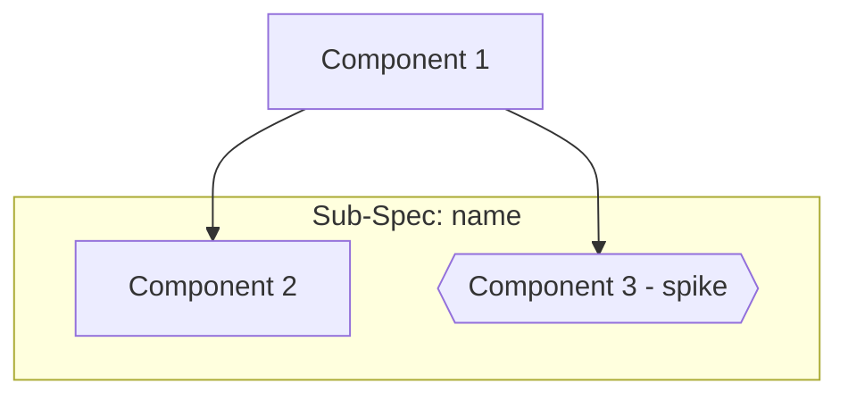

# Plan — {Feature Name}

> Implementation strategy derived from the spec. Reviewable checkpoint before
> writing code.

## Approach

{High-level strategy — 2-3 sentences describing the chosen approach and why.}

## Components

### {Component 1}

- **What**: {what this component does}
- **Files**: {files to create or modify}
- **Dependencies**: {what it depends on}

### {Component 2}

- **What**: {what this component does}
- **Files**: {files to create or modify}
- **Dependencies**: {what it depends on}

## Execution Order

1. {step_1 — what to implement first and why}
2. {step_2}
3. {step_3}

## Dependency Graph

> Optional — omit for simple plans without complex dependencies.

## Sub-Specs

> Optional — omit if no sub-specs were suggested.

| ID | Component | Status | Notes |
|----|-----------|--------|-------|
| {sub_001} | {component name} | pending | {notes} |

Status values: `pending` \| `in-progress` \| `complete`

## Risks & Mitigations

| Risk | Impact | Mitigation |
|------|--------|------------|
| {risk_1} | {high/medium/low} | {mitigation} |

## Testing Strategy

- **Unit**: {what to unit test}
- **Integration**: {what to integration test}
- **Manual verification**: {what to check manually}

## Alternatives Considered

| Alternative | Why rejected |
|-------------|-------------|
| {alt_1} | {reason} |
