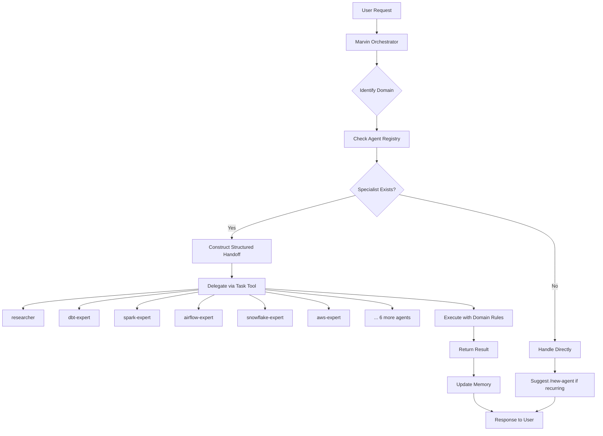

# Marvin

**An intelligent orchestration layer for Claude Code with specialized agents for Data Engineering and AI/ML**

Marvin transforms Claude Code into a domain-specialized assistant that automatically delegates tasks to expert agents, enforces best practices via hooks, and remembers your preferences across sessions.

## How It Works



## Prerequisites

- [uv](https://docs.astral.sh/uv/) — Python package manager (runs the install script)
- [Claude Code](https://docs.anthropic.com/en/docs/claude-code) — Anthropic's CLI

**Optional:** API keys for MCP servers that power the `researcher` agent:
- [Context7](https://context7.com) — official library documentation
- [Exa](https://exa.ai) — web search

## Installation

```bash
# 1. Clone the repository
git clone <repository-url> ~/Projects/marvin
cd ~/Projects/marvin

# 2. Install Marvin to a project
make install PROJECT=~/Projects/my-project

# 3. Start Claude Code in your project
cd ~/Projects/my-project
claude
```

The installer copies Marvin's `core/` layer into `<project>/.claude/` and deploys `.mcp.json` with `${VAR}` references that Claude Code resolves at runtime from your environment.

### MCP API Keys (Optional)

The `researcher` agent uses [Context7](https://context7.com) and [Exa](https://exa.ai) via MCP servers. Set the API keys as environment variables so Claude Code can resolve them at runtime.

**Option A — direnv (recommended, per-project)**

```bash
# Install direnv: https://direnv.net
echo 'export CONTEXT7_API_KEY="your-key"' >> ~/Projects/my-project/.envrc
echo 'export EXA_API_KEY="your-key"' >> ~/Projects/my-project/.envrc
direnv allow ~/Projects/my-project
```

**Option B — shell profile (global, all projects)**

```bash
# Add to ~/.zshrc or ~/.bashrc
export CONTEXT7_API_KEY="your-key"
export EXA_API_KEY="your-key"
```

**Option C — inline (temporary, current session only)**

```bash
CONTEXT7_API_KEY="your-key" EXA_API_KEY="your-key" claude
```

**Dev mode** (symlinks instead of copies — changes to `core/` take effect immediately):

```bash
make install-dev PROJECT=~/Projects/my-project
```

## Quick Start

```bash
# Initialize Marvin for your project type
> /init data-pipeline

# Research a topic (delegates to researcher agent)
> /research best practices for incremental dbt models

# Generate a dbt model (delegates to dbt-expert)
> /dbt-model orders fact table with customer and product dimensions

# Create an Airflow DAG (delegates to airflow-expert)
> /dag daily ETL pipeline from S3 to Snowflake

# Commit changes (delegates to git-expert)
> Commit these changes with an appropriate message
```

Marvin automatically routes each request to the right specialist.

## Documentation

| Document | Description |
|----------|-------------|
| [docs/agents.md](docs/agents.md) | All 12 specialist agents, routing triggers, and delegation rules |
| [docs/skills.md](docs/skills.md) | All slash commands with descriptions |
| [docs/hooks.md](docs/hooks.md) | Hook reference, quality gates, and settings |
| [docs/development.md](docs/development.md) | Project structure, workflow, Makefile targets, and contributing |
| [docs/concepts.md](docs/concepts.md) | Deep-dive into all architectural concepts and patterns |

---

[](LICENSE)
