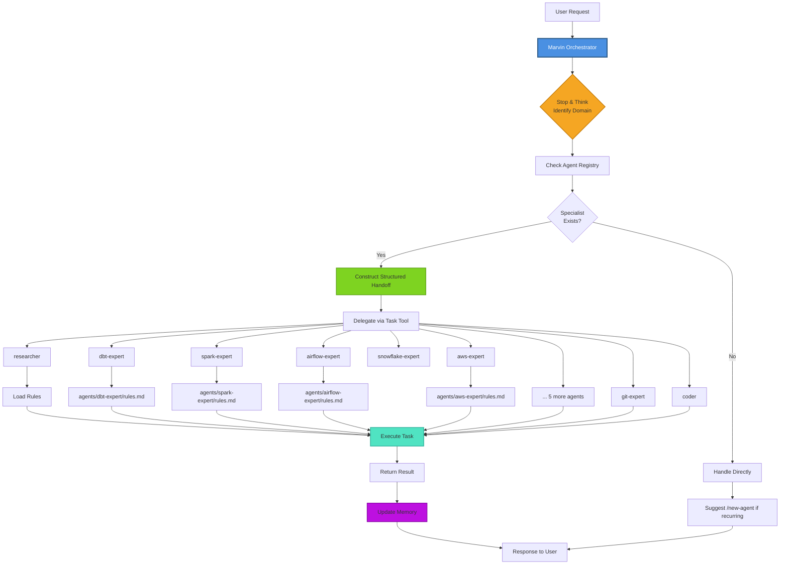

# Marvin

**An intelligent orchestrator for Claude Code with specialized agents for Data Engineering and AI/ML**

Marvin transforms Claude Code into a domain-specialized assistant that delegates tasks to expert agents, enforces best practices, and remembers your preferences across sessions.

## What is Marvin?

Marvin is an orchestration layer for Claude Code that automatically routes your requests to specialized agents based on domain triggers. Instead of handling everything directly, Marvin delegates to experts for dbt, Spark, Airflow, Snowflake, AWS, Git, Docker, and more.

**Key capabilities:**
- **Intelligent routing** to 13+ specialized agents
- **Domain expertise** loaded from comprehensive rule files
- **Persistent memory** for preferences and decisions
- **Structured handoffs** for complete context transfer
- **Extensible** with `/new-agent`, `/new-skill`, `/new-rule`

## How It Works



## Specialized Agents

| Agent | Triggers | Domain Knowledge |
|-------|----------|------------------|
| **researcher** | research, compare, find docs, how do I, what's the best | Context7 → Exa → WebSearch → WebFetch |
| **coder** | implement, refactor, write tests, fix bug, debug, 2+ files | Multi-file changes with tests |
| **verifier** | verify, validate, check quality, run tests | Quality checks and test execution |
| **dbt-expert** | dbt, data model, fact/dim table, staging, incremental | dbt conventions, testing, documentation |
| **spark-expert** | spark, pyspark, dataframe, rdd, shuffle, partition | PySpark optimization, performance tuning |
| **airflow-expert** | airflow, dag, operator, sensor, schedule, xcom | DAG patterns, idempotency, orchestration |
| **snowflake-expert** | snowflake, warehouse, clustering, rbac, time travel | Snowflake optimization, cost management |
| **aws-expert** | s3, glue, lambda, iam, cdk, step functions, kinesis | AWS data services, IaC patterns |
| **git-expert** | commit, git push, pull request, PR, branch | Git workflows, commit conventions |
| **docker-expert** | docker, dockerfile, container, image, docker-compose | Container optimization |
| **terraform-expert** | terraform, hcl, tfvars, tf plan/apply, module | Infrastructure as code |
| **python-expert** | python, pyproject.toml, pytest, typing, async | Python best practices |
| **docs-expert** | documentation, README, API docs, ADR, docstrings | Technical writing |

## Available Skills (Slash Commands)

| Category | Skill | Description |
|----------|-------|-------------|
| **Meta** | `/init` | Initialize project-specific Marvin config |
| | `/new-agent` | Scaffold a new specialized agent |
| | `/new-skill` | Create a new slash command |
| | `/new-rule` | Add domain knowledge rules |
| **Research** | `/research` | Deep web research with Context7 and Exa |
| | `/review` | Code review for quality and security |
| **Data Engineering** | `/pipeline` | Design complete data pipelines |
| | `/dbt-model` | Generate dbt models with tests |
| | `/dag` | Create Airflow DAGs |
| | `/data-model` | Design dimensional models |
| **Workflow** | `/spec` | OpenSpec Spec-Driven Development |
| | `/ralph` | Ralph Loop for autonomous tasks |
| | `/remember` | Save to persistent memory |

## Getting Started

### Installation

```bash
# Clone the repository
git clone <repository-url> ~/Projects/marvin
cd ~/Projects/marvin

# Run the installer (copies to ~/.claude/)
./install.sh

# Start Claude Code
claude
```

### Quick Start

```bash
# Initialize for your project type
> /init data-pipeline

# Try some commands
> /research best practices for incremental dbt models
> /dbt-model orders fact table with customer and product dimensions
> /dag daily ETL pipeline from S3 to Snowflake
> Commit these changes with an appropriate message
```

Marvin automatically delegates each request to the right specialist.

## Project Structure

```
marvin/
├── global/                 # Source of truth (deployed to ~/.claude/)
│   ├── CLAUDE.md           # Marvin orchestrator system prompt
│   ├── agents/             # Agent definitions + domain rules (13 specialists)
│   ├── skills/             # Slash command implementations
│   ├── rules/              # Universal rules (coding-standards, security)
│   ├── registry/           # Agent and skill registries
│   ├── reference/          # Workflow and protocol documentation
│   ├── templates/          # Scaffolding templates
│   ├── hooks/              # Shell hooks
│   ├── settings.json       # Claude Code settings
│   └── memory.md           # Persistent memory template
├── project-templates/      # /init templates
├── docs/                   # Architecture and concept documentation
├── scripts/                # Utility scripts (Ralph Loop, etc.)
├── research/               # Research artifacts and notes
├── install.sh              # Deployment script
└── .claude/                # Project dev instructions
```

## Development Workflow

**Critical Rule**: Always edit source files in `global/`, never in `~/.claude/` directly.

| What to Change | Edit Here | NOT Here |
|----------------|-----------|----------|
| Orchestrator logic | `global/CLAUDE.md` | `~/.claude/CLAUDE.md` |
| Agent definitions | `global/agents/<name>/AGENT.md` | `~/.claude/agents/` |
| Domain rules | `global/agents/<domain>-expert/rules.md` | `~/.claude/agents/` |
| Skills | `global/skills/<name>/SKILL.md` | `~/.claude/skills/` |

After editing, run `./install.sh` to deploy changes to `~/.claude/`.

## How Delegation Works

1. **Stop and Think**: Marvin identifies the domain before acting
2. **Check Registry**: Looks up the agent routing table
3. **Structured Handoff**: Constructs a complete context transfer with:
   - Objective (clear task description)
   - Acceptance criteria (definition of done)
   - Constraints (MUST/MUST NOT/PREFER)
   - Context (relevant files, decisions, preferences)
   - Return protocol (how to report results)
4. **Delegate**: Sends handoff to specialist via Task tool
5. **Execute**: Agent loads domain rules and completes task
6. **Memory**: Updates persistent memory with learnings

## Extending Marvin

```bash
# Add a new agent for a domain
> /new-agent kafka-expert "Kafka streaming patterns and optimization"

# Add a new skill/command
> /new-skill schema-registry "Generate and validate Avro schemas"

# Add domain knowledge
> /new-rule kafka

# Save a preference
> /remember We always use Snappy compression for Parquet files in production
```

## Contributing

Contributions welcome! To contribute:

1. Fork the repository
2. Create a feature branch
3. Edit files in `global/`
4. Test with `./install.sh --dry-run`
5. Submit a pull request

Ideas: new domain agents, additional skills, expanded rule patterns, project templates.

## License

MIT

## Acknowledgments

Built with Claude Opus 4.6 using the Claude Code CLI.

---

**Ready to get started?**

```bash
cd ~/Projects/marvin
./install.sh
claude
> Hello Marvin!
```
